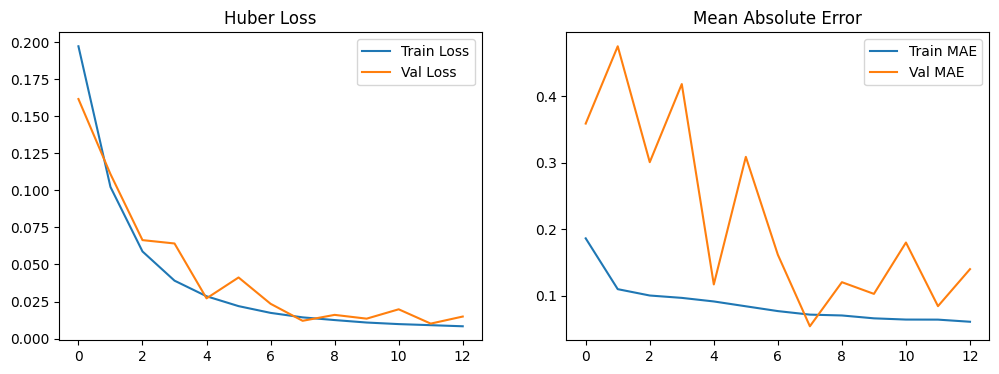
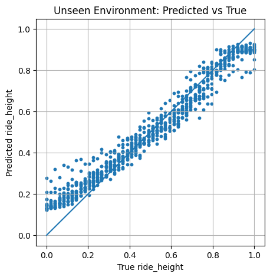
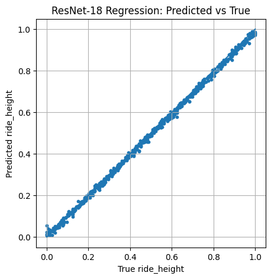
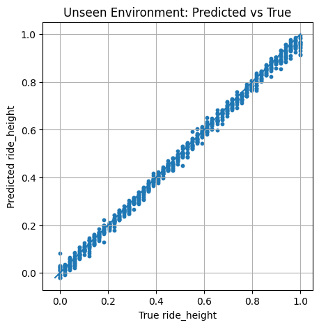

# Hydrofoil CV Depth Estimation

Synthetic vision dataset generation and depth-regression experiments for hydrofoil ride-height estimation.

<p align="center">
  
</p>

## Why This Project Exists

This project explores a practical question:

Can a CV model estimate **hydrofoil ride height** from rendered RGB images of water, wake, and lighting variation?

To answer that, the repo provides an end-to-end pipeline:

1. Generate physically rich synthetic scenes in Blender/BlenderProc.
2. Save each sample as HDF5 with image + metadata labels.
3. Compress datasets into WebP-packed HDF5 for efficient training.
4. Train and evaluate regression models (custom CNN + ResNet).

## Project At A Glance

- `hydrofoil.py`: main BlenderProc rendering script.
- `scene.blend`: Blender scene used for synthetic generation.
- `hdris/`, `hdris_validation/`: training and novel background lighting sets.
- `output_train/`, `output_novel/`: per-sample HDF5 outputs.
- `tools/consolidate.py`: converts per-frame HDF5 files into one compressed WebP HDF5.
- `tools/gen_animation.py`: builds preview GIFs from compressed datasets.
- `tools/show.py`: inspects a sample and metadata.
- `neural_nets/custom_tensorflow_cnn.ipynb`: TensorFlow/Keras training flow.
- `neural_nets/400_project_pytorch_vision_resnet.ipynb`: PyTorch ResNet baseline.

## What A Sample Contains

Each rendered `.hdf5` sample stores:

- `colors`: RGB image
- `ride_height`: normalized target value
- `hdri_source`: HDRI filename used for lighting
- `hdri_rotation`: randomized environment rotation
- `velocity`: forward motion speed used during trail rendering

After consolidation, images are stored as `colors_webp` byte arrays in a single HDF5 file (`hydrofoil_webp.hdf5`, `hydrofoil_novel_webp.hdf5`).

## Rendering Pipeline (How Data Is Made)

`hydrofoil.py` does the following:

1. Loads `scene.blend` with BlenderProc.
2. Configures camera intrinsics and motion blur.
3. Sweeps the hydrofoil/camera rig over ride-height values.
4. Randomizes appearance factors each render (noise seeds, HDRI, HDRI rotation).
5. Evaluates dynamic paint across full motion frames to preserve wake/foam trails.
6. Renders RGB and writes labeled HDF5 outputs.

This gives broad visual diversity while preserving a stable supervised label (`ride_height`).

## Quick Start

### 1) Install Dependencies

```bash
pip install -r requirements.txt
pip install h5py pillow tqdm numpy
```

You also need Blender and BlenderProc available in your environment.

### 2) Generate Synthetic Data

Run from repo root:

```bash
blenderproc run hydrofoil.py
```

Default output directory in script: `./output`.

### 3) Consolidate To Compressed HDF5

```bash
python tools/consolidate.py
```

Default behavior packs files from `./output_novel` into `hydrofoil_novel_webp.hdf5`.

### 4) Inspect A Sample

```bash
python tools/show.py 42 --file hydrofoil_webp.hdf5
```

### 5) Create A Visualization GIF

```bash
python tools/gen_animation.py --file hydrofoil_webp.hdf5 --step 5 --fps 12 --out filtered_anim.gif
```

## Modeling Notebooks

- `neural_nets/custom_tensorflow_cnn.ipynb`
  - HDF5 folder streaming loader
  - mixed precision enabled
  - train/val split and regression metrics
- `neural_nets/400_project_pytorch_vision_resnet.ipynb`
  - WebP-in-HDF5 dataset wrapper
  - ResNet-18 regression baseline
  - same-domain and novel-background evaluation

### Result Snapshots

<p align="center">
  
  
</p>

<p align="center">
  
  
</p>

## Recommended Workflow For Newcomers

1. Open `testing.ipynb` to inspect raw HDF5 samples visually.
2. Run `tools/show.py` on a few indices to understand metadata.
3. Generate or verify a compressed dataset with `tools/consolidate.py`.
4. Create a GIF with `tools/gen_animation.py` to sanity-check trends.
5. Run one modeling notebook end-to-end.
6. Compare same-domain vs novel-background performance plots.

## Configuration Tips

- In `hydrofoil.py`, tune:
  - `num_ride_heights`
  - `TOTAL_FRAMES`
  - `TRAVEL_DISTANCE`
  - render samples / denoising / motion blur
- Keep training and novel HDRI sets separate (`hdris/` vs `hdris_validation/`) for generalization testing.
- Use `output_train/` and `output_novel/` as distinct sources during experimentation.

## Troubleshooting

- If renders are empty or crash:
  - verify Blender version compatibility with BlenderProc.
  - verify `scene.blend` object names still match script assumptions (`Cylinder`, `Camera`).
- If training is slow:
  - use compressed WebP HDF5 files.
  - reduce batch size in notebooks.
- If labels look wrong:
  - inspect `ride_height` directly with `tools/show.py` or `testing.ipynb`.

## Future Ideas

- Add domain randomization for camera intrinsics and weather.
- Train temporal models over short wake sequences.
- Add uncertainty-aware regression outputs.
- Export a lightweight inference script for deployment.

---
